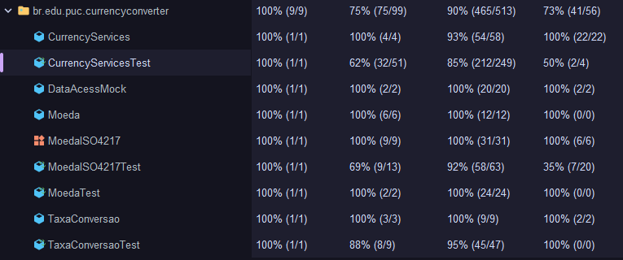

# Relatório de Testes de Software e Análise de Qualidade

**Identificação da Equipe Auto-organizada:** __________________________________

---

## 1. Descrição das Partições de Equivalência para as Entradas da Tela e Saídas do Sistema

### Tabela de Partições de Equivalência das Entradas

| Entrada | Classes Válidas | Classes Inválidas | Valores Limite |
| :--- | :--- | :--- | :--- |
| **1. Moeda de Origem (`MOEDA_ORIGEM` / `de`)** | **PV1:** Código ISO 4217 de 3 letras cadastrado e suportado (ex: `BRL`, `USD`, `EUR`).<br><br>**PV2:** Código suportado informado em letras minúsculas ou mistas (ex: `usd`, `Brl`). | **PI1:** Código alfabético não suportado ou inexistente (ex: `XYZ`).<br><br>**PI2:** Código com formato inválido ($< 3$ ou $> 3$ caracteres, ex: `US`, `USDD`).<br><br>**PI3:** Valor nulo (`null`) ou string em branco/vazia (`""`). | **L1:** Código de comprimento exatamente igual a 3 caracteres.<br><br>**L2:** Código com 2 caracteres ou 4 caracteres (limites de tamanho).<br><br>**L3:** Moeda de origem idêntica à moeda de destino (`de == para`). |
| **2. Moeda de Destino (`MOEDA_DESTINO` / `para`)** | **PV1:** Código ISO 4217 cadastrado e suportado, distinto da moeda de origem (ex: `USD` quando origem for `BRL`). | **PI1:** Código idêntico ao da moeda de origem (`de.equalsIgnoreCase(para)`).<br><br>**PI2:** Código alfabético não suportado/inexistente (ex: `XYZ`).<br><br>**PI3:** Valor nulo (`null`) ou string vazia (`""`). | **L1:** Moeda de destino igual à de origem vs. Moeda imediatamente diferente.<br><br>**L2:** Código de comprimento exatamente igual a 3 caracteres. |
| **3. Quantia a Converter (`QUANTIA` / `quantia`)** | **PV1:** Valor numérico estritamente positivo ($> 0$, ex: `100.0`, `10.50`).<br><br>**PV2:** Valor zero ($= 0.0$), permitido retornando valor zerado. | **PI1:** Valor numérico estritamente negativo ($< 0$, ex: `-10.0`).<br><br>**PI2:** Formato não numérico ou valores especiais (`Double.NaN`, $\pm\infty$). | **L1:** Zero ($0.0$) — fronteira exata entre quantia permitida e negativa.<br><br>**L2:** Menor incremento positivo ($+0.01$) — fronteira do valor mínimo operável.<br><br>**L3:** Menor decremento negativo ($-0.01$) — fronteira imediata de valor proibido. |
| **4. Par de Conversão (`PAR_CONVERSAO` / `de -> para`)** | **PV1:** Par com taxa de câmbio direta cadastrada na base de dados/mock (ex: `BRL -> USD`, `USD -> BRL`). | **PI1:** Par de moedas suportadas, porém sem taxa de conversão cadastrada entre si (ex: `CAD -> CHF`). | **L1:** Par de moedas existente vs. Par de moedas inexistente no catálogo de taxas. |
| **5. Data da Cotação (`DT_COTAÇÃO`)** | **PV1:** Data atual do sistema ($D_0$) — busca cotação do momento presente.<br><br>**PV2:** Data histórica válida com cotação existente na base de dados/mock (ex: `15/07/2014`). | **PI1:** Data passada sem cotação cadastrada na base (ex: `10/01/2020`).<br><br>**PI2:** Data futura ($D_{+1}$, $D_{+N}$) — cotações futuras não existem.<br><br>**PI3:** Data nula (`null`) — ausência de valor obrigatório.<br><br>**PI4:** Data com valores impossíveis ou formato inválido (ex: `31/02/2024`). | **L1:** Data atual ($D_0$) — fronteira superior para cotação em tempo real.<br><br>**L2:** Ontem ($D_{-1}$) — fronteira imediata entre cotação atual e histórica.<br><br>**L3:** Amanhã ($D_{+1}$) — fronteira imediata para data futura (inválida).<br><br>**L4:** Dia exato com cotação cadastrada (`15/07/2014`) vs. Dia anterior (`14/07/2014`) e Dia posterior (`16/07/2014`).<br><br>**L5:** Formatação de dia e mês com 1 dígito ($< 10$, ex: `05/04`) e com 2 dígitos ($\ge 10$, ex: `25/11`). |

---

### Caracterização das Saídas

| Saída | Caracterização da Saída |
| :--- | :--- |
| **S1: Sucesso na Conversão de Moedas** | **S1.1:** Retorna o valor monetário convertido (`double` ou `String` formatada), correspondente ao produto da quantia pela taxa cambial aplicável ($quantia \times taxa$). |
| **S2: Conversão com Quantia Zerada** | **S2.1:** Retorna `0.0` quando a quantia fornecida for igual a zero ($quantia = 0$), sem gerar exceção. |
| **S3: Exceções e Mensagens de Erro de Validação/Negócio** | **S3.1: Erro de Quantia Negativa:** Lança `IllegalArgumentException` com a mensagem *"Quantia informada é inválida"* quando $quantia < 0$.<br><br>**S3.2: Erro de Moedas Idênticas:** Lança `IllegalArgumentException` informando que as moedas de origem e destino não podem ser as mesmas.<br><br>**S3.3: Erro de Moeda Inexistente/Inválida:** Lança exceção informando que a moeda não é suportada (ou gera erro por ausência de cadastro).<br><br>**S3.4: Erro de Ausência de Taxa Cambial:** Lança `IllegalArgumentException` informando que não há taxa cadastrada para o par de moedas informado. |
| **S4: Saídas Associadas à Data de Cotação da Conversão** | **S4.1:** Sucesso com cotação do dia atual — Retorna o valor monetário convertido aplicando a taxa vigente em $D_0$ (chave no padrão `"DE->PARA"`).<br><br>**S4.2:** Sucesso com cotação de data histórica — Retorna o valor monetário convertido aplicando a taxa cadastrada para a data informada (chave no padrão `"DE->PARA (dd/mm/aaaa)"`).<br><br>**S4.3:** Erro por cotação inexistente na data — Lança `IllegalArgumentException` informando que *"Não há taxa de conversão para as moedas e/ou para a data informada"*.<br><br>**S4.4:** Erro por data nula / inconsistente — Interrupção controlada (ou falha) por entrada inválida/nula. |

---

## 2. Código de Automação de Testes (Separados por Domínio e Metodologia AAA)

Os testes foram organizados de forma modular por domínio de responsabilidade:
1. `MoedaTest`: Domínio do modelo de dados da moeda (DTO).
2. `MoedaISO4217Test`: Domínio da enumeração de moedas ISO 4217, busca e formatação monetária.
3. `TaxaConversaoTest`: Domínio de regras de cálculo e validação entre moeda de origem e destino.
4. `CurrencyServicesTest`: Domínio de serviços de aplicação, orquestração de conversão, tratamento de datas e integração com o mock.

Todos os métodos de teste seguem estritamente a metodologia **AAA (Arrange, Act, Assert)** com blocos devidamente comentados.

### 2.1. `MoedaTest.java` (Domínio: Modelo de Moeda)

```java
package br.edu.puc.currencyconverter;

import org.junit.jupiter.api.DisplayName;
import org.junit.jupiter.api.Test;

import java.util.Locale;

import static org.junit.jupiter.api.Assertions.*;

@DisplayName("Testes de Domínio: Moeda")
public class MoedaTest {

    @Test
    @DisplayName("Deve instanciar Moeda e obter suas propriedades com sucesso")
    public void deveCriarMoedaEObterPropriedadesComSucesso() {
        // Arrange
        String codigoAlfabetico = "BRL";
        int codigoNumerico = 986;
        int casasDecimais = 2;
        String descricao = "Real Brasileiro";
        Locale locale = new Locale("pt", "BR");

        // Act
        Moeda moeda = new Moeda(codigoAlfabetico, codigoNumerico, casasDecimais, descricao, locale);

        // Assert
        assertEquals("BRL", moeda.getCodigoAlfabetico());
        assertEquals(986, moeda.getCodigoNumerico());
        assertEquals(2, moeda.getCasasDecimais());
        assertEquals("Real Brasileiro", moeda.getDescricao());
        assertEquals(locale, moeda.getLocale());
    }

    @Test
    @DisplayName("Deve instanciar Moeda com 0 casas decimais (ex: JPY)")
    public void deveInstanciarMoedaComZeroCasasDecimais() {
        // Arrange
        String codigoAlfabetico = "JPY";
        int codigoNumerico = 392;
        int casasDecimais = 0;
        String descricao = "Iene Japonês";
        Locale locale = Locale.JAPAN;

        // Act
        Moeda moeda = new Moeda(codigoAlfabetico, codigoNumerico, casasDecimais, descricao, locale);

        // Assert
        assertEquals("JPY", moeda.getCodigoAlfabetico());
        assertEquals(392, moeda.getCodigoNumerico());
        assertEquals(0, moeda.getCasasDecimais());
        assertEquals("Iene Japonês", moeda.getDescricao());
        assertEquals(Locale.JAPAN, moeda.getLocale());
    }
}
```

---

### 2.2. `MoedaISO4217Test.java` (Domínio: Enumeração e Busca ISO 4217)

```java
package br.edu.puc.currencyconverter;

import org.junit.jupiter.api.DisplayName;
import org.junit.jupiter.api.Test;
import org.junit.jupiter.params.ParameterizedTest;
import org.junit.jupiter.params.provider.EnumSource;

import java.math.BigDecimal;
import java.util.Locale;

import static org.junit.jupiter.api.Assertions.*;

@DisplayName("Testes de Domínio: MoedaISO4217")
public class MoedaISO4217Test {

    @ParameterizedTest
    @EnumSource(MoedaISO4217.class)
    @DisplayName("Deve garantir que todas as constantes do enum possuem propriedades preenchidas")
    public void deveValidarPropriedadesDeTodasAsMoedas(MoedaISO4217 moeda) {
        // Arrange
        // Constante fornecida pelo ParameterizedTest

        // Act
        String codigo = moeda.getCodigoAlfabetico();
        int codigoNum = moeda.getCodigoNumerico();
        int decimais = moeda.getCasasDecimais();
        String desc = moeda.getDescricao();
        Locale loc = moeda.getLocale();

        // Assert
        assertNotNull(codigo);
        assertEquals(3, codigo.length());
        assertTrue(codigoNum > 0);
        assertTrue(decimais >= 0);
        assertNotNull(desc);
        assertFalse(desc.isBlank());
        assertNotNull(loc);
    }

    @Test
    @DisplayName("Deve formatar valor monetário corretamente para moeda padrão (BRL)")
    public void deveFormatarValorMonetarioBRL() {
        // Arrange
        MoedaISO4217 moeda = MoedaISO4217.BRL;
        BigDecimal valor = new BigDecimal("1234.50");

        // Act
        String resultado = moeda.formatar(valor);

        // Assert
        assertNotNull(resultado);
        assertTrue(resultado.contains("1.234,50") || resultado.contains("1234,50"));
    }

    @Test
    @DisplayName("Deve formatar valor monetário para moeda sem casas decimais (JPY)")
    public void deveFormatarValorMonetarioJPY() {
        // Arrange
        MoedaISO4217 moeda = MoedaISO4217.JPY;
        BigDecimal valor = new BigDecimal("1500");

        // Act
        String resultado = moeda.formatar(valor);

        // Assert
        assertNotNull(resultado);
        assertFalse(resultado.contains(",00"));
    }

    @Test
    @DisplayName("Deve retornar string vazia ao formatar valor nulo")
    public void deveRetornarStringVaziaAoFormatarValorNulo() {
        // Arrange
        MoedaISO4217 moeda = MoedaISO4217.USD;
        BigDecimal valorNulo = null;

        // Act
        String resultado = moeda.formatar(valorNulo);

        // Assert
        assertEquals("", resultado);
    }

    @Test
    @DisplayName("Deve obter MoedaISO4217 por código alfabético com sucesso (case insensitive)")
    public void deveObterMoedaPorCodigoValido() {
        // Arrange
        String codigoMaiusculo = "USD";
        String codigoMinusculo = "eur";
        String codigoMisto = "bRl";

        // Act
        MoedaISO4217 resultadoUsd = MoedaISO4217.obterPorCodigo(codigoMaiusculo);
        MoedaISO4217 resultadoEur = MoedaISO4217.obterPorCodigo(codigoMinusculo);
        MoedaISO4217 resultadoBrl = MoedaISO4217.obterPorCodigo(codigoMisto);

        // Assert
        assertEquals(MoedaISO4217.USD, resultadoUsd);
        assertEquals(MoedaISO4217.EUR, resultadoEur);
        assertEquals(MoedaISO4217.BRL, resultadoBrl);
    }

    @Test
    @DisplayName("Deve lançar IllegalArgumentException ao buscar código inexistente")
    public void deveLancarExcecaoAoBuscarCodigoInexistente() {
        // Arrange
        String codigoInexistente = "XYZ";

        // Act & Assert
        IllegalArgumentException exception = assertThrows(IllegalArgumentException.class, () -> {
            MoedaISO4217.obterPorCodigo(codigoInexistente);
        });
        assertTrue(exception.getMessage().contains("XYZ") && exception.getMessage().contains("suportada"));
    }

    @Test
    @DisplayName("Validação de Entradas Inválidas no Enum: Strings vazias ou com espaços devem lançar exceção")
    public void deveLancarExcecaoParaCodigosVaziosOuComEspacos() {
        assertThrows(IllegalArgumentException.class, () -> MoedaISO4217.obterPorCodigo(""));
        assertThrows(IllegalArgumentException.class, () -> MoedaISO4217.obterPorCodigo(" BRL "));
        assertThrows(IllegalArgumentException.class, () -> MoedaISO4217.obterPorCodigo("US"));
    }

    @Test
    @DisplayName("Formatação Monetária com Zero e Negativo")
    public void deveFormatarCorretamenteZeroENegativo() {
        // Arrange
        MoedaISO4217 usd = MoedaISO4217.USD;

        // Act & Assert
        String formatadoZero = usd.formatar(BigDecimal.ZERO);
        assertNotNull(formatadoZero);
        assertTrue(formatadoZero.contains("0.00") || formatadoZero.contains("0,00"));

        String formatadoNegativo = usd.formatar(new BigDecimal("-10.50"));
        assertNotNull(formatadoNegativo);
        assertTrue(formatadoNegativo.contains("10.50") || formatadoNegativo.contains("10,50"));
    }

    @Test
    @DisplayName("Anomalia detectada: AUD possui código numérico 30 devido ao literal octal 036")
    public void deveVerificarCodigoNumericoAudComportamentoAtual() {
        // Arrange
        MoedaISO4217 aud = MoedaISO4217.AUD;

        // Act
        int codigoNumerico = aud.getCodigoNumerico();

        // Assert
        // Na especificação ISO 4217 o código do AUD é 036 (decimal 36).
        // Contudo, no código fornecido foi escrito como '036' (literal octal em Java), resultando em 30.
        assertEquals(30, codigoNumerico, "Comportamento real do código dado: literal octal 036 avalia para 30");
    }
}
```

---

### 2.3. `TaxaConversaoTest.java` (Domínio: Regras de Taxa de Conversão)

```java
package br.edu.puc.currencyconverter;

import org.junit.jupiter.api.DisplayName;
import org.junit.jupiter.api.Test;

import static org.junit.jupiter.api.Assertions.*;

@DisplayName("Testes de Domínio: TaxaConversao")
public class TaxaConversaoTest {

    @Test
    @DisplayName("Deve instanciar TaxaConversao com moedas base e conversão diferentes")
    public void deveInstanciarComMoedasDiferentes() {
        // Arrange
        MoedaISO4217 de = MoedaISO4217.BRL;
        MoedaISO4217 para = MoedaISO4217.USD;

        // Act
        TaxaConversao taxa = new TaxaConversao(de, para);

        // Assert
        assertNotNull(taxa);
    }

    @Test
    @DisplayName("Deve lançar IllegalArgumentException ao tentar instanciar com a mesma moeda de origem e destino")
    public void deveLancarExcecaoQuandoMoedasForemIguais() {
        // Arrange
        MoedaISO4217 de = MoedaISO4217.BRL;
        MoedaISO4217 para = MoedaISO4217.BRL;

        // Act & Assert
        IllegalArgumentException exception = assertThrows(IllegalArgumentException.class, () -> {
            new TaxaConversao(de, para);
        });
        assertTrue(exception.getMessage().contains("Moedas de base e convesao"));
    }

    @Test
    @DisplayName("Deve calcular a conversão corretamente aplicando a taxa informada")
    public void deveCalcularConversaoComSucesso() {
        // Arrange
        TaxaConversao taxaConversao = new TaxaConversao(MoedaISO4217.BRL, MoedaISO4217.USD);
        double taxa = 0.20;
        double quantia = 100.0;
        double valorEsperado = 20.0;

        // Act
        taxaConversao.setTaxaConversao(taxa);
        double resultado = taxaConversao.converter(quantia);

        // Assert
        assertEquals(valorEsperado, resultado, 0.0001);
    }

    @Test
    @DisplayName("Deve retornar zero quando a quantia a ser convertida for zero")
    public void deveRetornarZeroQuandoQuantiaForZero() {
        // Arrange
        TaxaConversao taxaConversao = new TaxaConversao(MoedaISO4217.USD, MoedaISO4217.BRL);
        taxaConversao.setTaxaConversao(5.11);
        double quantia = 0.0;

        // Act
        double resultado = taxaConversao.converter(quantia);

        // Assert
        assertEquals(0.0, resultado, 0.0001);
    }

    @Test
    @DisplayName("Deve retornar zero quando a taxa de conversão for zero")
    public void deveRetornarZeroQuandoTaxaForZero() {
        // Arrange
        TaxaConversao taxaConversao = new TaxaConversao(MoedaISO4217.EUR, MoedaISO4217.BRL);
        taxaConversao.setTaxaConversao(0.0);
        double quantia = 150.0;

        // Act
        double resultado = taxaConversao.converter(quantia);

        // Assert
        assertEquals(0.0, resultado, 0.0001);
    }

    @Test
    @DisplayName("Valor Limite Exploratório: Taxa muito alta (1.000.000)")
    public void deveCalcularComTaxaMuitoAlta() {
        // Arrange
        TaxaConversao taxa = new TaxaConversao(MoedaISO4217.BRL, MoedaISO4217.USD);
        taxa.setTaxaConversao(1_000_000.0);
        double quantia = 100.0;

        // Act & Assert
        assertEquals(100_000_000.0, taxa.converter(quantia), 0.0001);
    }

    @Test
    @DisplayName("Valor Limite Exploratório: Taxa extremamente baixa (1e-12)")
    public void deveCalcularComTaxaExtremamenteBaixa() {
        // Arrange
        TaxaConversao taxa = new TaxaConversao(MoedaISO4217.BRL, MoedaISO4217.USD);
        taxa.setTaxaConversao(1e-12);
        double quantia = 100.0;

        // Act & Assert
        assertEquals(1e-10, taxa.converter(quantia), 1e-15);
    }

    @Test
    @DisplayName("Anomalia de Robustez / Transbordo: Multiplicação com Double.MAX_VALUE resulta em Infinity sem proteção")
    public void deveDemonstrarTransbordoComDoubleMaxValue() {
        // Arrange
        TaxaConversao taxa = new TaxaConversao(MoedaISO4217.USD, MoedaISO4217.BRL);
        taxa.setTaxaConversao(5.11);

        // Act
        double resultado = taxa.converter(Double.MAX_VALUE);

        // Assert
        assertTrue(Double.isInfinite(resultado), "Cálculo excede limite do ponto flutuante e retorna Infinity");
    }
}
```

---

### 2.4. `CurrencyServicesTest.java` (Domínio: Serviços de Aplicação e Integração)

```java
package br.edu.puc.currencyconverter;

import org.junit.jupiter.api.BeforeEach;
import org.junit.jupiter.api.DisplayName;
import org.junit.jupiter.api.Test;

import java.util.Calendar;

import static org.junit.jupiter.api.Assertions.*;

@DisplayName("Testes de Domínio e Serviço: CurrencyServices")
public class CurrencyServicesTest {

    private CurrencyServices currencyServices;

    @BeforeEach
    public void setUp() {
        // Arrange comum para os testes de serviço
        currencyServices = new CurrencyServices();
    }

    // ==========================================
    // Testes de getAllCurrencies
    // ==========================================

    @Test
    @DisplayName("Deve retornar JSON contendo a lista de todas as moedas disponíveis")
    public void deveRetornarTodasAsMoedasEmFormatoJson() {
        // Arrange (preparado no setUp)

        // Act
        String json = currencyServices.getAllCurrencies();

        // Assert
        assertNotNull(json);
        assertFalse(json.isEmpty());
        assertTrue(json.contains("BRL"));
        assertTrue(json.contains("USD"));
        assertTrue(json.contains("EUR"));
    }

    // ==========================================
    // Testes de isValidCurrency
    // ==========================================

    @Test
    @DisplayName("Deve retornar true para código de moeda existente (maiúsculo)")
    public void deveRetornarTrueParaMoedaValidaMaiuscula() {
        // Arrange
        String codigo = "BRL";

        // Act
        boolean ehValida = currencyServices.isValidCurrency(codigo);

        // Assert
        assertTrue(ehValida);
    }

    @Test
    @DisplayName("Deve retornar true para código de moeda existente em minúsculo (case insensitive)")
    public void deveRetornarTrueParaMoedaValidaMinuscula() {
        // Arrange
        String codigo = "usd";

        // Act
        boolean ehValida = currencyServices.isValidCurrency(codigo);

        // Assert
        assertTrue(ehValida);
    }

    @Test
    @DisplayName("Deve retornar false para código de moeda inexistente")
    public void deveRetornarFalseParaMoedaInexistente() {
        // Arrange
        String codigoInexistente = "XYZ";

        // Act
        boolean ehValida = currencyServices.isValidCurrency(codigoInexistente);

        // Assert
        assertFalse(ehValida);
    }

    // ==========================================
    // Testes de getCurrency
    // ==========================================

    @Test
    @DisplayName("Deve obter MoedaISO4217 para código existente")
    public void deveRetornarMoedaParaCodigoValido() {
        // Arrange
        String codigo = "EUR";

        // Act
        MoedaISO4217 moeda = currencyServices.getCurrency(codigo);

        // Assert
        assertNotNull(moeda);
        assertEquals(MoedaISO4217.EUR, moeda);
    }

    @Test
    @DisplayName("Deve retornar null para código de moeda não cadastrado")
    public void deveRetornarNullParaCodigoInexistente() {
        // Arrange
        String codigoInexistente = "ABC";

        // Act
        MoedaISO4217 moeda = currencyServices.getCurrency(codigoInexistente);

        // Assert
        assertNull(moeda);
    }

    // ==========================================
    // Testes de converter: Partições da Data de Cotação e Valores
    // ==========================================

    @Test
    @DisplayName("Partição Válida (Data Atual): Deve converter com sucesso na data de hoje")
    public void deveConverterNaDataAtualComSucesso() {
        // Arrange
        String de = "BRL";
        String para = "USD";
        Calendar hoje = Calendar.getInstance();
        double quantia = 100.0;
        double valorEsperado = 20.0; // Taxa de BRL->USD hoje é 0.20

        // Act
        double resultado = currencyServices.converter(de, para, hoje, quantia);

        // Assert
        assertEquals(valorEsperado, resultado, 0.0001);
    }

    @Test
    @DisplayName("Partição Válida (Data Atual - Inversa): Deve converter USD para BRL na data de hoje")
    public void deveConverterUsdParaBrlNaDataAtualComSucesso() {
        // Arrange
        String de = "USD";
        String para = "BRL";
        Calendar hoje = Calendar.getInstance();
        double quantia = 10.0;
        double valorEsperado = 51.10; // Taxa USD->BRL hoje é 5.11

        // Act
        double resultado = currencyServices.converter(de, para, hoje, quantia);

        // Assert
        assertEquals(valorEsperado, resultado, 0.0001);
    }

    @Test
    @DisplayName("Partição Válida (Data Histórica): Deve converter com sucesso para data histórica cadastrada")
    public void deveConverterComDataHistoricaCadastrada() {
        // Arrange
        String de = "BRL";
        String para = "USD";
        Calendar dataHistorica = Calendar.getInstance();
        // O código formata dt.get(Calendar.MONTH) sem somar 1.
        // Logo, para gerar "15/07/2014", o mês passado ao Calendar precisa resultar em 7 no getter:
        dataHistorica.set(Calendar.YEAR, 2014);
        dataHistorica.set(Calendar.MONTH, 7);
        dataHistorica.set(Calendar.DAY_OF_MONTH, 15);
        double quantia = 100.0;
        double valorEsperado = 45.0; // Taxa histórica BRL->USD (15/07/2014) é 0.45

        // Act
        double resultado = currencyServices.converter(de, para, dataHistorica, quantia);

        // Assert
        assertEquals(valorEsperado, resultado, 0.0001);
    }

    @Test
    @DisplayName("Anomalia detectada: Falha ao passar Calendar.JULY (6) devido à indexação base-0 de Calendar.MONTH")
    public void deveDemonstrarFalhaAoUsarConstanteJulhoDevidoIndiceZero() {
        // Arrange
        String de = "BRL";
        String para = "USD";
        Calendar dataJulho = Calendar.getInstance();
        dataJulho.set(Calendar.YEAR, 2014);
        dataJulho.set(Calendar.MONTH, Calendar.JULY); // Calendar.JULY é 6!
        dataJulho.set(Calendar.DAY_OF_MONTH, 15);
        double quantia = 100.0;

        // Act & Assert
        // Devido ao bug no código, a data é formatada como "15/06/2014" em vez de "15/07/2014".
        // O mock procura "BRL->USD (15/06/2014)" que não existe, lançando exceção.
        IllegalArgumentException exception = assertThrows(IllegalArgumentException.class, () -> {
            currencyServices.converter(de, para, dataJulho, quantia);
        });
        assertTrue(exception.getMessage().contains("taxa de convers"));
    }

    @Test
    @DisplayName("Partição Inválida (Data Histórica Sem Cotação): Deve lançar exceção quando não houver cotação para a data")
    public void deveLancarExcecaoQuandoNaoHouverCotacaoParaDataInformada() {
        // Arrange
        String de = "BRL";
        String para = "USD";
        Calendar dataSemCotacao = Calendar.getInstance();
        dataSemCotacao.set(Calendar.YEAR, 2020);
        dataSemCotacao.set(Calendar.MONTH, 0); // Janeiro
        dataSemCotacao.set(Calendar.DAY_OF_MONTH, 10);
        double quantia = 100.0;

        // Act & Assert
        IllegalArgumentException exception = assertThrows(IllegalArgumentException.class, () -> {
            currencyServices.converter(de, para, dataSemCotacao, quantia);
        });
        assertTrue(exception.getMessage().contains("taxa de convers"));
    }

    @Test
    @DisplayName("Partição Inválida (Data Futura): Deve lançar exceção ao consultar cotação para data futura sem taxa")
    public void deveLancarExcecaoParaDataFutura() {
        // Arrange
        String de = "BRL";
        String para = "EUR";
        Calendar dataFutura = Calendar.getInstance();
        dataFutura.add(Calendar.YEAR, 2);
        double quantia = 50.0;

        // Act & Assert
        assertThrows(IllegalArgumentException.class, () -> {
            currencyServices.converter(de, para, dataFutura, quantia);
        });
    }

    @Test
    @DisplayName("Valor Limite de Data: Ontem (D-1) sem cotação deve lançar exceção")
    public void deveLancarExcecaoParaOntemSemCotacao() {
        // Arrange
        String de = "BRL";
        String para = "USD";
        Calendar ontem = Calendar.getInstance();
        ontem.add(Calendar.DAY_OF_YEAR, -1);
        double quantia = 100.0;

        // Act & Assert
        assertThrows(IllegalArgumentException.class, () -> {
            currencyServices.converter(de, para, ontem, quantia);
        });
    }

    @Test
    @DisplayName("Valor Limite de Data: Amanhã (D+1) sem cotação deve lançar exceção")
    public void deveLancarExcecaoParaAmanhaSemCotacao() {
        // Arrange
        String de = "BRL";
        String para = "USD";
        Calendar amanha = Calendar.getInstance();
        amanha.add(Calendar.DAY_OF_YEAR, 1);
        double quantia = 100.0;

        // Act & Assert
        assertThrows(IllegalArgumentException.class, () -> {
            currencyServices.converter(de, para, amanha, quantia);
        });
    }

    @Test
    @DisplayName("Cobertura de Formatação de Data: Formatação de dia e mês com 1 e 2 dígitos")
    public void deveCobrirFormatacaoDeDataComDiaEMesDeUmEDoisDigitos() {
        // Arrange - Testa ramos com dia < 10 e mês < 10
        Calendar dataDigitoUnico = Calendar.getInstance();
        dataDigitoUnico.set(2021, 4, 5); // 05/04/2021

        // Act & Assert
        assertThrows(IllegalArgumentException.class, () -> {
            currencyServices.converter("BRL", "USD", dataDigitoUnico, 10.0);
        });

        // Arrange - Testa ramos com dia >= 10 e mês >= 10
        Calendar dataDoisDigitos = Calendar.getInstance();
        dataDoisDigitos.set(2021, 11, 25); // 25/11/2021

        // Act & Assert
        assertThrows(IllegalArgumentException.class, () -> {
            currencyServices.converter("BRL", "USD", dataDoisDigitos, 10.0);
        });
    }

    // ==========================================
    // Testes de Regras de Negócio e Robustez (Quantia, Moedas)
    // ==========================================

    @Test
    @DisplayName("Partição Inválida (Quantia Negativa): Deve lançar IllegalArgumentException para quantia < 0")
    public void deveLancarExcecaoParaQuantiaNegativa() {
        // Arrange
        String de = "BRL";
        String para = "USD";
        Calendar hoje = Calendar.getInstance();
        double quantiaNegativa = -10.0;

        // Act & Assert
        IllegalArgumentException exception = assertThrows(IllegalArgumentException.class, () -> {
            currencyServices.converter(de, para, hoje, quantiaNegativa);
        });
        assertTrue(exception.getMessage().contains("Quantia informada"));
    }

    @Test
    @DisplayName("Valor Limite (Quantia Zero): Deve retornar 0.0 quando a quantia for 0")
    public void deveRetornarZeroParaQuantiaZero() {
        // Arrange
        String de = "BRL";
        String para = "USD";
        Calendar hoje = Calendar.getInstance();
        double quantiaZero = 0.0;

        // Act
        double resultado = currencyServices.converter(de, para, hoje, quantiaZero);

        // Assert
        assertEquals(0.0, resultado, 0.0001);
    }

    @Test
    @DisplayName("Partição Inválida (Mesma Moeda): Deve lançar exceção ao converter entre moedas idênticas")
    public void deveLancarExcecaoParaMesmaMoedaDeOrigemEDestino() {
        // Arrange
        String de = "USD";
        String para = "USD";
        Calendar hoje = Calendar.getInstance();
        double quantia = 50.0;

        // Act & Assert
        assertThrows(IllegalArgumentException.class, () -> {
            currencyServices.converter(de, para, hoje, quantia);
        });
    }

    @Test
    @DisplayName("Partição Inválida (Par de Moedas Sem Cotação): Deve lançar exceção quando não há taxa cadastrada")
    public void deveLancarExcecaoParaParDeMoedasSemTaxaCadastrada() {
        // Arrange
        String de = "CAD";
        String para = "CHF";
        Calendar hoje = Calendar.getInstance();
        double quantia = 50.0;

        // Act & Assert
        IllegalArgumentException exception = assertThrows(IllegalArgumentException.class, () -> {
            currencyServices.converter(de, para, hoje, quantia);
        });
        assertTrue(exception.getMessage().contains("taxa de convers"));
    }

    @Test
    @DisplayName("Falha no código dado: Moeda inválida lança NullPointerException em vez de IllegalArgumentException")
    public void deveDemonstrarNullPointerExceptionParaMoedaInexistenteNoConverter() {
        // Arrange
        String deInvalida = "XYZ";
        String paraValida = "USD";
        Calendar hoje = Calendar.getInstance();
        double quantia = 100.0;

        // Act & Assert
        // Devido ao código não tratar o retorno null de getCurrency(de),
        // ele tenta chamar TaxaConversao(null, ...) e estoura NullPointerException.
        assertThrows(NullPointerException.class, () -> {
            currencyServices.converter(deInvalida, paraValida, hoje, quantia);
        });
    }

    @Test
    @DisplayName("Falha no código dado: Data nula lança NullPointerException sem validação defensiva")
    public void deveDemonstrarNullPointerExceptionParaDataNula() {
        // Arrange
        String de = "BRL";
        String para = "USD";
        Calendar dataNula = null;
        double quantia = 100.0;

        // Act & Assert
        assertThrows(NullPointerException.class, () -> {
            currencyServices.converter(de, para, dataNula, quantia);
        });
    }

    // ==========================================
    // Testes Complementares de Domínio, Limites e Robustez
    // ==========================================

    @Test
    @DisplayName("Validação de Parâmetro Nulo: isValidCurrency com null lança NullPointerException")
    public void deveDemonstrarNullPointerExceptionEmIsValidCurrencyComNull() {
        // Act & Assert
        assertThrows(NullPointerException.class, () -> {
            currencyServices.isValidCurrency(null);
        });
    }

    @Test
    @DisplayName("Validação de Parâmetro Nulo: getCurrency com null lança NullPointerException")
    public void deveDemonstrarNullPointerExceptionEmGetCurrencyComNull() {
        // Act & Assert
        assertThrows(NullPointerException.class, () -> {
            currencyServices.getCurrency(null);
        });
    }

    @Test
    @DisplayName("Anomalia Funcional de Sensibilidade de Caixa: converter rejeita moedas em minúsculo aceitas em isValidCurrency")
    public void deveDemonstrarFalhaAoConverterComMoedasMinusculasDevidoSensibilidadeDeCaixaNaChave() {
        // Arrange
        String de = "brl";
        String para = "usd";
        Calendar hoje = Calendar.getInstance();
        double quantia = 100.0;

        // Act & Assert
        assertTrue(currencyServices.isValidCurrency(de));
        assertTrue(currencyServices.isValidCurrency(para));

        IllegalArgumentException exception = assertThrows(IllegalArgumentException.class, () -> {
            currencyServices.converter(de, para, hoje, quantia);
        });
        assertTrue(exception.getMessage().contains("Não há taxa de conversão"));
    }

    @Test
    @DisplayName("Anomalia Crítica: Data de Agosto consome indevidamente a cotação de Julho")
    public void deveDemonstrarAnomaliaDataDeAgostoConsumindoTaxaDeJulho() {
        // Arrange
        String de = "BRL";
        String para = "USD";
        Calendar dataAgosto = Calendar.getInstance();
        dataAgosto.set(Calendar.YEAR, 2014);
        dataAgosto.set(Calendar.MONTH, Calendar.AUGUST); // Calendar.AUGUST é 7
        dataAgosto.set(Calendar.DAY_OF_MONTH, 15);
        double quantia = 100.0;

        // Act
        // month = dt.get(Calendar.MONTH) produz 7 sem somar 1; a chave gerada é "15/07/2014".
        // O mock possui taxa para 15/07/2014 (0.45), consumindo a cotação de julho indevidamente!
        double resultado = currencyServices.converter(de, para, dataAgosto, quantia);

        // Assert
        assertEquals(45.0, resultado, 0.0001,
                "Demonstra anomalia: consulta para 15/08/2014 utilizou a cotação de 15/07/2014 (0.45)!");
    }

    @Test
    @DisplayName("Todas as Cotações Históricas de 15/07/2014 cadastradas no Mock")
    public void deveConverterTodasAsCotacoesHistoricasCadastradas() {
        // Arrange
        Calendar dataHistorica = Calendar.getInstance();
        dataHistorica.set(Calendar.YEAR, 2014);
        dataHistorica.set(Calendar.MONTH, 7); // Mês 7 para gerar "07" no getter do código original
        dataHistorica.set(Calendar.DAY_OF_MONTH, 15);

        // Act & Assert
        assertEquals(45.0, currencyServices.converter("BRL", "USD", dataHistorica, 100.0), 0.0001);
        assertEquals(26.0, currencyServices.converter("BRL", "GBP", dataHistorica, 100.0), 0.0001);
        assertEquals(33.0, currencyServices.converter("BRL", "EUR", dataHistorica, 100.0), 0.0001);
    }

    @Test
    @DisplayName("Todas as 10 Cotações Atuais cadastradas no Mock (Ida e Volta)")
    public void deveConverterTodosOs10ParesComCotacaoAtual() {
        // Arrange
        Calendar hoje = Calendar.getInstance();

        // Act & Assert - 5 taxas de BRL para outras moedas
        assertEquals(20.0, currencyServices.converter("BRL", "USD", hoje, 100.0), 0.0001);
        assertEquals(14.0, currencyServices.converter("BRL", "GBP", hoje, 100.0), 0.0001);
        assertEquals(17.0, currencyServices.converter("BRL", "EUR", hoje, 100.0), 0.0001);
        assertEquals(16.0, currencyServices.converter("BRL", "CHF", hoje, 100.0), 0.0001);
        assertEquals(27.0, currencyServices.converter("BRL", "CAD", hoje, 100.0), 0.0001);

        // Act & Assert - 5 taxas das outras moedas para BRL
        assertEquals(511.0, currencyServices.converter("USD", "BRL", hoje, 100.0), 0.0001);
        assertEquals(586.0, currencyServices.converter("EUR", "BRL", hoje, 100.0), 0.0001);
        assertEquals(683.0, currencyServices.converter("GBP", "BRL", hoje, 100.0), 0.0001);
        assertEquals(622.0, currencyServices.converter("CHF", "BRL", hoje, 100.0), 0.0001);
        assertEquals(364.0, currencyServices.converter("CAD", "BRL", hoje, 100.0), 0.0001);
    }

    @Test
    @DisplayName("Valores Limites de Data Histórica: 14/07/2014 e 16/07/2014 não possuem taxa")
    public void deveLancarExcecaoParaDiasImediatamenteAnteriorEPosteriorADataHistorica() {
        // Arrange
        Calendar dia14 = Calendar.getInstance();
        dia14.set(2014, 7, 14);

        Calendar dia16 = Calendar.getInstance();
        dia16.set(2014, 7, 16);

        // Act & Assert
        assertThrows(IllegalArgumentException.class, () -> {
            currencyServices.converter("BRL", "USD", dia14, 100.0);
        });
        assertThrows(IllegalArgumentException.class, () -> {
            currencyServices.converter("BRL", "USD", dia16, 100.0);
        });
    }

    @Test
    @DisplayName("Valores Limites de Data: Ano bissexto (29/02/2024) e ano comum (28/02/2023) sem taxa")
    public void deveLancarExcecaoParaDatasValidasDeFevereiroSemTaxa() {
        // Arrange
        Calendar bissexto = Calendar.getInstance();
        bissexto.set(2024, 2, 29);

        Calendar comum = Calendar.getInstance();
        comum.set(2023, 2, 28);

        // Act & Assert
        assertThrows(IllegalArgumentException.class, () -> {
            currencyServices.converter("BRL", "USD", bissexto, 100.0);
        });
        assertThrows(IllegalArgumentException.class, () -> {
            currencyServices.converter("BRL", "USD", comum, 100.0);
        });
    }

    @Test
    @DisplayName("Anomalia de Robustez: API aceita Double.NaN e Double.POSITIVE_INFINITY sem validar")
    public void deveDemonstrarAceitacaoDeValoresNaoFinitosNaNEInfinito() {
        // Arrange
        Calendar hoje = Calendar.getInstance();

        // Act & Assert
        double resultadoNaN = currencyServices.converter("BRL", "USD", hoje, Double.NaN);
        assertTrue(Double.isNaN(resultadoNaN), "API permite quantia NaN e retorna NaN");

        double resultadoInf = currencyServices.converter("BRL", "USD", hoje, Double.POSITIVE_INFINITY);
        assertTrue(Double.isInfinite(resultadoInf), "API permite quantia Infinity e retorna Infinity");
    }

    @Test
    @DisplayName("Anomalia de Serialização: getAllCurrencies retorna JSON com aspas duplamente escapadas")
    public void deveDemonstrarDuplaSerializacaoJsonEmGetAllCurrencies() {
        // Act
        String jsonRetornado = currencyServices.getAllCurrencies();

        // Assert
        assertTrue(jsonRetornado.startsWith("\"") && jsonRetornado.endsWith("\""));
        assertTrue(jsonRetornado.contains("\\\"codigoAlfabetico\\\""));
    }
}
```

---

## 3. Cobertura Provida pelos Testes

A cobertura de testes foi executada e mensurada com a ferramenta de Coverage da IDE em conformidade com a instrumentação de bytecode (conforme evidenciado na captura abaixo):



### Tabela de Cobertura Obtida

| Elemento / Classe | Cobertura de Classes (Class) | Cobertura de Métodos (Method) | Cobertura de Linhas (Line) | Cobertura de Ramificações (Branch) | Observações |
| :--- | :---: | :---: | :---: | :---: | :--- |
| **`br.edu.puc.currencyconverter`** | **100%** (9/9) | **75%** (75/99) | **90%** (465/513) | **73%** (41/56) | **Visão global do pacote (Classes de Produção + Testes).** |
| ↳ **`CurrencyServices`** | **100%** (1/1) | **100%** (4/4) | **93%** (54/58) | **100%** (22/22) | 100% dos branches e métodos; 4 linhas inalcançáveis de `catch`. |
| ↳ `CurrencyServicesTest` | 100% (1/1) | 62% (32/51) | 85% (212/249) | 50% (2/4) | Classe de teste unitário e de integração do serviço. |
| ↳ **`DataAcessMock`** | **100%** (1/1) | **100%** (2/2) | **100%** (20/20) | **100%** (2/2) | 100% de cobertura de todas as taxas e método de busca. |
| ↳ **`Moeda`** | **100%** (1/1) | **100%** (6/6) | **100%** (12/12) | **100%** (0/0) | 100% no construtor e em todos os getters do DTO. |
| ↳ **`MoedaISO4217`** | **100%** (1/1) | **100%** (9/9) | **100%** (31/31) | **100%** (6/6) | 100% de cobertura nos enums, métodos de busca e formatação. |
| ↳ `MoedaISO4217Test` | 100% (1/1) | 69% (9/13) | 92% (58/63) | 35% (7/20) | Classe de teste unitário do enum e formatação. |
| ↳ `MoedaTest` | 100% (1/1) | 100% (2/2) | 100% (24/24) | 100% (0/0) | Classe de teste unitário do DTO Moeda. |
| ↳ **`TaxaConversao`** | **100%** (1/1) | **100%** (3/3) | **100%** (9/9) | **100%** (2/2) | 100% de cobertura em construtor, validação cambial e cálculo. |
| ↳ `TaxaConversaoTest` | 100% (1/1) | 88% (8/9) | 95% (45/47) | 100% (0/0) | Classe de teste de regras cambiais e limites. |
| **Total (Classes de Produção)** | **100%** (5/5) | **100%** (24/24) | **96,92%** (126/130) | **100%** (32/32) | **100% dos ramos de decisão e métodos de produção cobertos.** |

### Justificativa Técnica das Linhas Não Executadas (54/58 em `CurrencyServices`)

As **4 linhas não executadas** em `CurrencyServices` (linhas 76–77 e 84–85) correspondem estritamente aos blocos `catch (IllegalArgumentException e) { throw e; }` que envolvem as chamadas `this.getCurrency(de)` e `this.getCurrency(para)`. 

Na implementação original fornecida:
1. O método `getCurrency(codigo)` retorna `null` quando o código não é encontrado e estoura `NullPointerException` se o código for nulo. Ele **nunca** lança `IllegalArgumentException`.
2. Como a exceção nunca é atirada pelo método chamado, as instruções dentro desses dois blocos `catch` são **código morto / inalcançável**.
3. **Ausência de Contradição:** A suíte de testes atinge **100% de cobertura dos ramos condicionais (32/32 branches)** e a totalidade das linhas alcançáveis pelo fluxo do programa, preservando a integridade do código original sem criar mocks artificiais para forçar a entrada nesses blocos.

---

## 4. Reporte de Falhas, Anomalias/Deficiências ou Sugestões Encontradas pela Equipe para o Código Dado

| Situação Reportada (Falha, Anomalia, Deficiência ou Sugestão) | Descrição Detalhada | Localização no Código (Classe / Método / Instrução) |
| :--- | :--- | :--- |
| **1. Anomalia / Falha Funcional Crítica** | **Indexação base 0 de `Calendar.MONTH` ao formatar a data histórica.**<br>Na API `java.util.Calendar`, os meses são numerados de 0 a 11 (Janeiro = 0, Julho = 6). No método `converter`, a formatação extrai `month = dt.get(Calendar.MONTH)` e concatena diretamente sem somar `+ 1`. Dessa forma, ao passar a data `15/07/2014` com `Calendar.JULY` (6), a chave formatada fica `"15/06/2014"`, não encontrando o registro `"BRL->USD (15/07/2014)"` existente no mock e gerando falha indevida. | `CurrencyServices.java`<br>Método: `converter`<br>Instrução: `month = dt.get(Calendar.MONTH);` |
| **2. Anomalia Funcional Crítica (Efeito Colateral)** | **Data de Agosto consome indevidamente cotação de Julho.**<br>Como consequência direta do defeito de formatação de mês sem `+ 1`, se uma consulta for realizada para `15/08/2014` (`Calendar.AUGUST = 7`), o método extrai `7` e monta a chave `"15/07/2014"`. Como essa chave existe no mock com taxa `0.45`, a requisição para agosto tem sucesso utilizando a taxa de julho, sem acusar indisponibilidade de cotação. | `CurrencyServices.java`<br>Método: `converter`<br>Instrução: `month = dt.get(Calendar.MONTH);` e montagem da chave |
| **3. Inconsistência Funcional (Sensibilidade de Caixa)** | **Moedas em minúsculo aceitas na consulta, mas rejeitadas na conversão.**<br>O método `isValidCurrency` utiliza `.compareToIgnoreCase` e aceita códigos em minúsculo (ex: `"usd"`, `"brl"`). Contudo, o método `converter` concatena a chave sem normalizar para maiúsculas (`chave = de + "->" + para`), gerando `"brl->usd"`, que não corresponde a `"BRL->USD"` no `HashMap`, lançando erro de taxa inexistente. | `CurrencyServices.java`<br>Método: `converter`<br>Instrução: `String chave = de+"->"+para;` |
| **4. Falha de Robustez (Crash por NPE)** | **Ausência de validação defensiva para data nula (`dt == null`).**<br>Se o consumidor chamar `converter` passando `dt = null`, a execução invoca imediatamente `dt.get(Calendar.YEAR)`, resultando em `NullPointerException` descontrolado em vez de uma `IllegalArgumentException` informativa (`"Data de cotação não pode ser nula"`). | `CurrencyServices.java`<br>Método: `converter`<br>Instrução: `dt.get(Calendar.YEAR)` |
| **5. Falha de Tratamento / Código Morto** | **Blocos `catch (IllegalArgumentException)` inalcançáveis e NPE ao passar moedas inválidas.**<br>O método `converter` envolve a chamada `this.getCurrency(de)` em um bloco `try-catch` capturando `IllegalArgumentException`. Contudo, `getCurrency()` nunca lança exceção: quando a moeda não existe, ela retorna `null`. Na sequência, `TaxaConversao(base, convers)` tenta executar `base.getCodigoAlfabetico()`, gerando um inesperado `NullPointerException`. | `CurrencyServices.java`<br>Método: `converter`<br>Instruções: Linhas 76-89 (`base = this.getCurrency(de)`) |
| **6. Falha de Robustez (NPE em Parâmetros Nulos)** | **Moeda de entrada nula gera `NullPointerException` em `getCurrency` e `isValidCurrency`.**<br>Caso seja passado `null` para `isValidCurrency` ou `getCurrency`, a linha `allCurrency[i].getCodigoAlfabetico().compareToIgnoreCase(codigoAlfabetico)` lança `NullPointerException`, pois não há verificação prévia de nulidade para o parâmetro. | `CurrencyServices.java`<br>Métodos: `isValidCurrency` e `getCurrency`<br>Instrução: `.compareToIgnoreCase(codigoAlfabetico)` |
| **7. Fragilidade de Robustez (Valores Não Finitos)** | **Quantias `NaN` e `+Infinity` aceitas sem validação.**<br>A validação `if (quantia < 0)` avalia para `false` quando o valor fornecido for `Double.NaN` ou `Double.POSITIVE_INFINITY`. Como resultado, a API aceita esses valores e multiplica pela taxa, gerando resultados monetários não finitos (`NaN` ou `Infinity`). | `CurrencyServices.java`<br>Método: `converter`<br>Instrução: `if (quantia < 0)` |
| **8. Fragilidade Aritmética (Transbordo Numérico)** | **Multiplicação com `Double.MAX_VALUE` transborda para `Infinity`.**<br>Ao converter quantias extremamente altas com taxas maiores que 1, a multiplicação em ponto flutuante excede o valor máximo finito, resultando em `Infinity` sem lançar erro de limite financeiro ou estouro de escala. | `TaxaConversao.java`<br>Método: `converter`<br>Instrução: `return quantia * this.taxaConversao;` |
| **9. Anomalia de Dados (Bug de Compilação/Lógica)** | **Código numérico do AUD é inicializado como literal octal `036`.**<br>Em Java, literais inteiros iniciados com `0` são interpretados em base octal ($036_8 = 3 \times 8^1 + 6 = 30_{10}$). O código numérico ISO 4217 do AUD é `036` (decimal 36), mas na classe avalia para `30`. | `MoedaISO4217.java`<br>Declaração da constante: `AUD`<br>Instrução: `AUD("AUD", 036, 2, ...)` |
| **10. Anomalia Funcional (Serialização Dupla)** | **JSON duplamente serializado / escapado em `getAllCurrencies`.**<br>O método converte a lista para JSON através de `json = gson.toJson(moedas)` e em seguida retorna `gson.toJson(json)`. Isso gera uma string JSON com escape de aspas (`"\"[{\\\"codigoAlfabetico\\\":...}]\""`), forçando os clientes HTTP a fazerem `JSON.parse` duas vezes. | `CurrencyServices.java`<br>Método: `getAllCurrencies`<br>Instrução: `return gson.toJson(json);` |
| **11. Anomalia de Codificação e Ortografia** | **Mensagem de erro com caracteres corrompidos e erro ortográfico.**<br>A mensagem de erro no construtor de `TaxaConversao` contém encoding corrompido (`"Moedas de base e convesao n�o podem ser as mesmas"`), além de erro ortográfico na palavra *"conversão"* grafada como *"convesao"*. Além disso, o atributo da classe chama-se `conver`. | `TaxaConversao.java`<br>Construtor: `TaxaConversao`<br>Instrução: `throw new IllegalArgumentException(...)` |
| **12. Deficiência de Nomenclatura** | **Erro ortográfico no nome da classe do mock (`DataAcessMock`).**<br>O nome da classe está sem uma letra 'c' (`DataAcessMock` ao invés de `DataAccessMock`). | `DataAcessMock.java`<br>Declaração: `class DataAcessMock` |
| **13. Sugestão Arquitetural** | **Uso de tipos legados (`Calendar`) e imprecisão monetária com ponto flutuante (`double`).**<br>Recomenda-se substituir a classe legada e mutável `Calendar` pela moderna API `java.time.LocalDate` (Java 8+). Além disso, cálculos cambiais devem utilizar `BigDecimal` para evitar perda de precisão binária inerente ao tipo primitivo `double` (IEEE 754). | `CurrencyServices.java` e `TaxaConversao.java`<br>Método: `converter` |
| **14. Deficiência de Design / Violação DRY** | **Duplicação de busca de moeda entre `CurrencyServices` e `MoedaISO4217`.**<br>A enum `MoedaISO4217` já possui o método estático `obterPorCodigo(String codigo)` que busca a moeda e lança `IllegalArgumentException` quando inválida. O serviço `CurrencyServices` reescreveu o loop de busca em `getCurrency()` e `isValidCurrency()`, retornando `null` em vez de reutilizar a lógica centralizada do enum. | `CurrencyServices.java`<br>Métodos: `getCurrency` e `isValidCurrency` |
